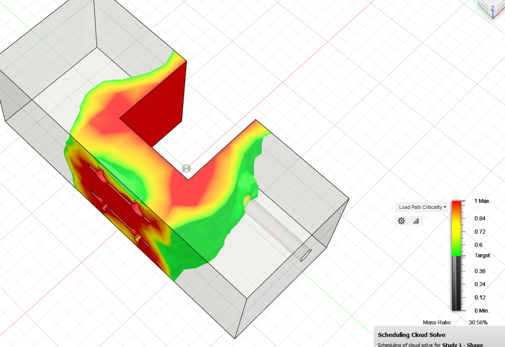
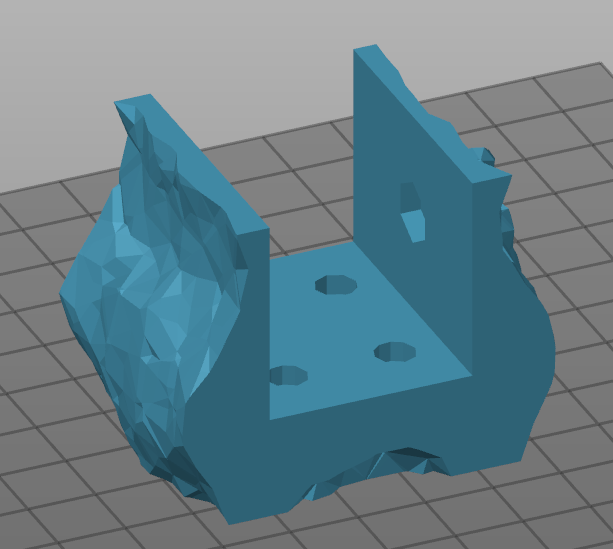

# MQTT Controls

A project to try out physical controls for Internet of Things devices using MQTT and an ESP8266.

### Current Implementation

The current implementation uses piezoelectric drums salvaged from a ['Guitar Hero' drum kit](https://en.wikipedia.org/wiki/Guitar_Hero_World_Tour#Drums) to control a light bulb and power switch over [MQTT](https://en.wikipedia.org/wiki/MQTT). The drum is wired up to a [LM339](http://www.ti.com/product/LM339) comparator which triggers an interrupt on the ESP8266 when the drum is hit.

### Models

Part of the project involved clamping the drum face to the side of a table, so I modelled and 3D printed a clamp, which can be found in the `models` folder. I used whatever screws and bolts I had on hand, so the model will need to be modified for use by others. The modelling software used was [SolveSpace](https://github.com/solvespace/solvespace).

The basic clamp broke fairly quickly at the corner, so I ran it through topology optimisation offered in Fusion360.

|Fusion360|Slic3r|
|-|-|
|||

#### Physical Setup

